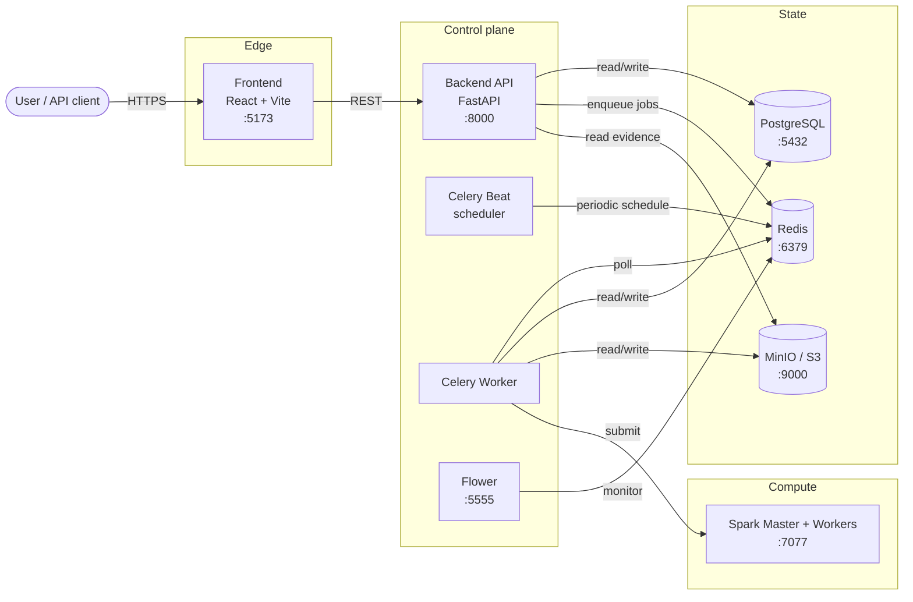
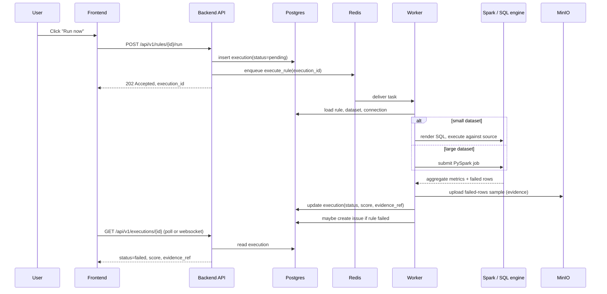
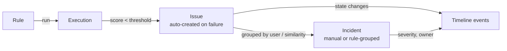

# Architecture

This document explains how CogniDQ is wired and what each component
does.

---

## Big picture



---

## Components

### Frontend (`frontend/`)

- **Stack:** React 18, Vite, TypeScript.
- **Role:** the user-facing single-page application. Renders pages for
  workspace, datasets, rules, executions, issues, incidents,
  dashboards, and admin screens.
- **Auth:** JWT bearer token, kept in `localStorage`, refreshed via the
  refresh-token endpoint.
- **API client:** centralised in `frontend/src/services/`. Components
  never call `fetch` directly.

### Backend API (`backend/app/`)

- **Stack:** FastAPI, SQLAlchemy 2.x, Pydantic v2, Alembic for
  migrations.
- **Role:** the control plane. Owns the data model and all business
  logic that is not specific to executing a rule. RBAC is enforced at
  every endpoint via FastAPI dependencies.
- **Layout:**
  - `app/api/v1/endpoints/` — HTTP endpoints, grouped by domain
  - `app/services/` — business logic
  - `app/models/` — SQLAlchemy ORM models
  - `app/schemas/` — Pydantic request/response models
  - `app/workers/` — Celery task definitions
  - `app/core/` — config, security, logging

### Worker (`backend/app/workers/`)

- **Stack:** Celery with Redis broker.
- **Role:** runs all asynchronous work — rule executions, evidence
  serialization, scheduled jobs.
- **Concurrency:** scale by running multiple `worker` containers behind
  the same broker.

### Beat

- **Role:** Celery Beat, a single-instance periodic scheduler. Reads
  rule schedules from the DB and enqueues `execute_rule` tasks at the
  right cadence.

### Execution engine

CogniDQ supports two execution modes, chosen automatically per rule
based on dataset size (`SPARK_AUTO_THRESHOLD`, default 50 000 rows):

1. **SQL pushdown** — for small/medium datasets that live in a SQL
   source (PostgreSQL today). The engine renders the rule into a SQL
   query, runs it against the source DB, and returns aggregate metrics
   plus a sample of failing rows.
2. **Spark** — for large datasets, datasets in object storage, or rules
   that cannot be expressed as a single SQL statement. The worker
   submits a PySpark job to the Spark master.

### Scheduler / queue

- **Redis** is both the Celery broker and a small cache.
- One Redis logical DB (`/0`) for queue + result backend.

### State

- **PostgreSQL** holds all metadata: tenants, workspaces, users, roles,
  datasets, connections, rules, rule versions, executions, issues,
  incidents, evidence references, audit events.
- **MinIO / S3** holds binary artifacts: uploaded CSVs, failed-row
  evidence samples, rule import/export bundles.

### Observability

- **Flower** monitors Celery (queues, workers, tasks).
- The backend exposes `/health`, `/ready`, and `/metrics`. See
  [observability.md](observability.md).

---

## Multi-tenancy model

```text
Platform
  └─ Tenant
        └─ Workspace
              ├─ Datasets
              ├─ Rules
              ├─ Executions
              ├─ Issues / Incidents
              └─ Members (with workspace-scoped roles)
```

- **Platform** is the deployment-wide singleton. Platform admins manage
  tenants and global settings.
- **Tenant** is an organisation boundary. Tenant admins manage
  workspaces and tenant-level membership.
- **Workspace** is the unit of authoring. Datasets, rules, executions,
  and issues are owned by a workspace.

Every API request is scoped: the JWT identifies the user; the user's
membership in a tenant + workspace determines what the request can see
and modify. See [rbac.md](rbac.md).

---

## Data flow: a single rule execution



---

## Issue / incident flow



- One **execution** can produce zero or one **issue** per rule run.
- Issues default to `status=open`, `severity=<rule.severity>`.
- Stewards triage issues. Manually grouping related issues creates an
  **incident**.
- Both have a timeline of state-change events stored in the DB.

---

## Configuration model

Configuration is loaded from `backend/.env` (or the equivalent
environment variables) at process start. Config is grouped by domain in
`app/core/config.py`. Feature flags follow `ENABLE_*` naming. See
[configuration.md](configuration.md) (TBD) for the full reference.

---

## Security boundaries

- **Frontend ↔ Backend:** JWT bearer token. CORS limited via
  `BACKEND_CORS_ORIGINS`.
- **Backend ↔ Postgres:** internal Compose network only by default.
  Should be on a private network in production with TLS.
- **Backend ↔ External data sources:** credentials stored encrypted with
  `CREDENTIAL_ENCRYPTION_KEY` (Fernet). Connector code uses the
  decrypted credentials at execution time only.
- **Worker ↔ Source DBs:** read-only by design. Connectors enforce
  read-only by setting the connection to `READ ONLY` where supported.
- **Evidence:** sample of failing rows. May contain sensitive data.
  Stored in MinIO with workspace-level prefix; bucket access restricted
  to the backend / worker. Production deployments should add
  field-level masking — see [production-hardening.md](production-hardening.md).

---

## What CogniDQ is **not**

See [product-scope.md](product-scope.md) for the explicit non-goals.
The architecture above does **not** include:

- a real-time streaming layer (Kafka, Flink, etc.). Execution is batch.
- a metadata catalog backend. CogniDQ integrates with catalogs
  (OpenMetadata, experimental) but does not replace them.
- a write path back into source systems. Connectors are read-only.
