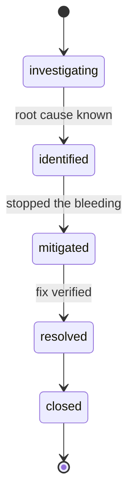

# Incidents

An **incident** groups related issues into a single named event so
stewards and stakeholders can manage the response as one unit.

Related: [issues.md](issues.md), [rule-engine.md](rule-engine.md).

---

## When to use an incident vs an issue

| Use an **issue** when … | Use an **incident** when … |
|---|---|
| One rule failed on one dataset. | Multiple rules / datasets are affected by what looks like one root cause. |
| The fix is local (one column, one job). | The fix involves coordination (multiple teams, customer comms, data backfill). |
| You don't need to communicate it externally. | Stakeholders need a single status to follow. |

A rough heuristic: if you'd write a postmortem, you have an incident.

## Lifecycle



States:

- **investigating** — opened; root cause unknown.
- **identified** — root cause found, fix in progress.
- **mitigated** — short-term mitigation in place; full fix pending.
- **resolved** — full fix verified.
- **closed** — terminal state; postmortem (if any) attached.

## Anatomy

```jsonc
{
  "id": "inc_01HXYZ",
  "workspace_id": "ws_demo",
  "title": "Customer-data quality regression",
  "severity": "high",
  "status": "investigating",
  "owner_user_id": "user_steward",
  "started_at": "2026-06-15T10:00:00Z",
  "mitigated_at": null,
  "resolved_at": null,
  "issue_ids": ["iss_01HX...", "iss_01HY..."],
  "labels": ["customer-data"],
  "comments_count": 5,
  "summary": "Spike of completeness + uniqueness failures on customers dataset following ETL change."
}
```

## Creating an incident

Two paths:

1. **From the issues list:** select N issues that share a root cause
   and click **Group as incident**. The selected issues link to the new
   incident; severity defaults to the highest among them.
2. **Manually:** **Incidents → New**. Useful when the incident is
   declared before any single rule has failed (e.g. an upstream
   provider notified you).

You can attach more issues to an existing incident at any time; you can
also detach an issue if it turns out to be unrelated.

## Severity

Incident severity is a separate concept from issue severity. The
incident severity is the highest severity that the responder thinks the
*incident as a whole* warrants — usually equal to or above the highest
linked issue.

| Severity | Typical incident |
|---|---|
| `low` | Minor recurring DQ noise grouped for hygiene. |
| `medium` | Real but contained problem. |
| `high` | Stakeholders are watching; fix this sprint. |
| `critical` | Active business harm right now. |

## Timeline

Like issues, incidents have an append-only timeline of state changes,
severity changes, comments, and issue attach/detach events.

The timeline is the artefact you'd export when writing a post-incident
review.

## Postmortems

In v0.1, the postmortem is a free-text field plus the timeline. We do
not enforce a template. We recommend recording:

- a one-paragraph summary,
- impact (who/what was affected, for how long),
- root cause,
- timeline (we render it for you),
- what went well, what didn't, follow-up actions.

A more formal postmortem flow is on the roadmap.

## Notifications

When an incident is created or its severity is changed, the workspace
administrators and the incident owner are notified. Status changes
notify only the owner and watchers (people who commented).

## Anti-patterns

- Opening an incident for every failed rule. That's what issues are for.
- Closing an incident before the issues are resolved.
- Using incidents as long-running "themes". If a thing is a theme,
  it's a label or a project, not an incident.
