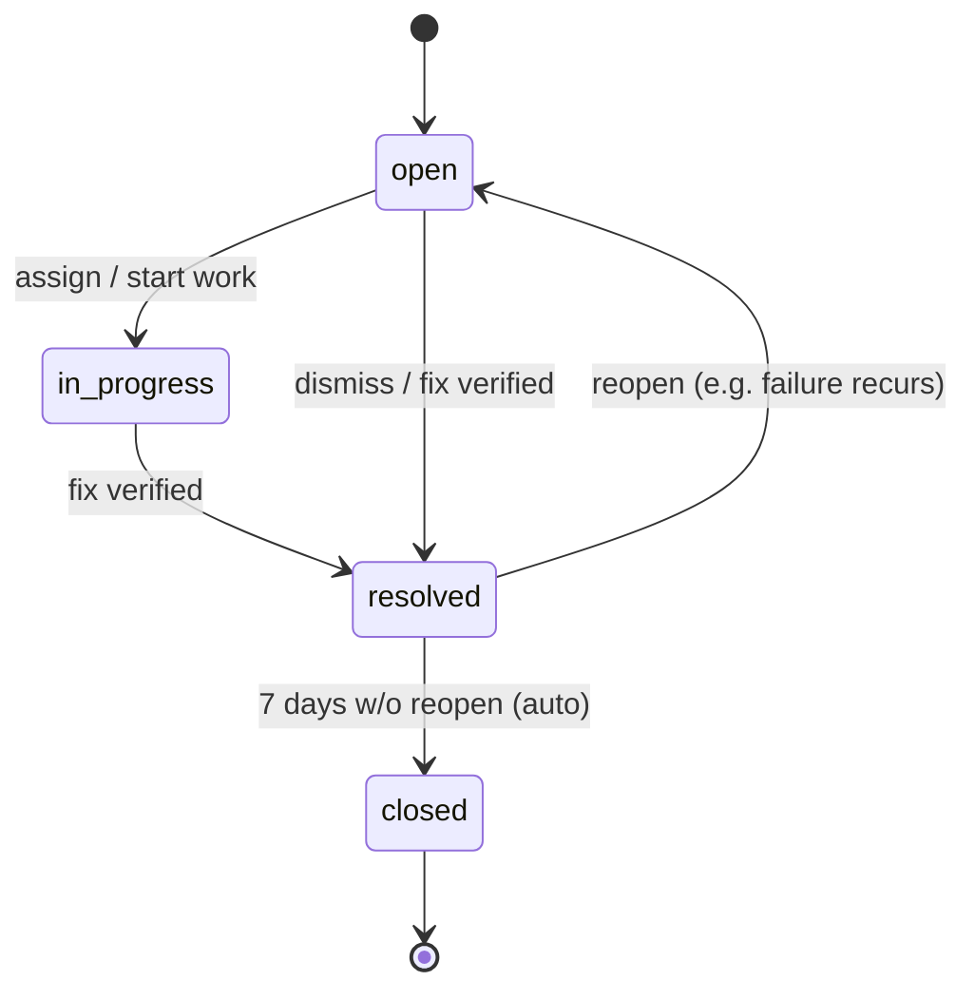

# Issues

An **issue** is the unit of work for fixing a data quality problem.
Failed rule executions auto-create issues; humans triage them.

Related: [incidents.md](incidents.md), [evidence.md](evidence.md),
[rule-engine.md](rule-engine.md).

---

## Lifecycle



States:

- **open** — newly created or reopened; awaiting triage.
- **in_progress** — someone is actively working on it.
- **resolved** — root cause fixed; rule passes again.
- **closed** — terminal state; auto-closed N days after resolve, or
  manually closed.

`closed` is reachable from `resolved` only. To stop work without
fixing, change to `resolved` with reason `dismissed`.

## Anatomy

```jsonc
{
  "id": "iss_01HXYZ",
  "workspace_id": "ws_demo",
  "rule_id": "rule_01HXYZ",
  "title": "customers.email is not null — failed",
  "severity": "medium",                  // low | medium | high | critical
  "status": "open",                      // open | in_progress | resolved | closed
  "assignee_user_id": null,
  "incident_id": null,                   // set if grouped into an incident
  "first_seen_at": "2026-06-15T10:00:00Z",
  "last_seen_at": "2026-06-15T18:00:00Z",
  "executions_count": 14,                // number of failed executions linked
  "comments_count": 3,
  "labels": ["completeness", "ws_demo"],
  "evidence_ref": "evidence/ws_demo/exec_01HXYZ.json"
}
```

## Auto-creation rules

When an execution lands with `status=failed`:

1. Look for an open or in-progress issue for the same `rule_id` in the
   same workspace.
2. If found: append a comment referencing the new execution; update
   `last_seen_at` and `executions_count`.
3. If not found: create a new issue with the rule's severity and
   default assignee.

This keeps issue count bounded. A rule that fails on every schedule
creates **one** issue with many linked executions, not one per run.

## Manual creation

Stewards can also create an issue manually (e.g. someone reports a
problem they noticed in a dashboard). Manual issues do not require a
rule; they require a workspace, a title, and a severity.

## Triage workflow

A typical triage session by a steward:

1. Open the **Issues** page for the workspace.
2. Filter by severity = `high` and status ∈ `{open, in_progress}`.
3. For each issue:
   - Read the rule and the most recent failed execution.
   - Look at the evidence sample.
   - Decide: assign to engineer? change severity? group into an
     existing incident? mark resolved?
4. Add a comment recording the decision.

The UI also exposes "bulk actions": assign / re-severity / close N
issues at once.

## Severity guidance

| Severity | Typical use |
|---|---|
| `low` | Cosmetic or downstream-tolerated issue. |
| `medium` | Real problem, no operational impact yet. |
| `high` | Customer-facing or report-blocking; fix this sprint. |
| `critical` | Data is wrong in a way that causes business harm right now. |

The default severity comes from the rule. Stewards can override per
issue.

## Comments and timeline

Every state change, severity change, assignment, and comment is recorded
on the issue's timeline. Comments support markdown and `@mentions`
(workspace members only).

The timeline is append-only at the application level — you cannot edit
or delete a past timeline event from the UI. (Direct DB writes can,
obviously; protect the DB.)

## Labels

Issues automatically get labels for the rule type and the workspace.
You can add custom labels in the UI. Labels are workspace-local; we do
not expose tenant- or platform-wide labels yet.

## Notifications

By default, the assignee is notified by email when:

- they are assigned an issue,
- the severity is escalated,
- a comment `@mentions` them.

Email delivery uses the `MAIL_*` settings; see
[production-hardening.md](production-hardening.md). In the local stack
no real emails are sent — they are logged to the backend container.

## Bulk import / export

Issues can be exported per workspace as CSV or JSON via
`GET /api/v1/issues?format=csv`. Bulk import is not supported in v0.1.

## Limits

- Maximum 5 000 issues per workspace surface in one query (paginate).
- Auto-close after `ISSUE_AUTO_CLOSE_DAYS` (default 7) once resolved.
- Reopening an issue resets the auto-close counter.

## Anti-patterns

- Treating issues as a generic ticket queue. Issues are about data
  quality findings; if you need a ticket system, use one.
- Ignoring severity. If everything is `high`, nothing is.
- Closing an issue without resolving the underlying rule failure. The
  rule will fail again and a new issue (or a reopened one) will appear.
