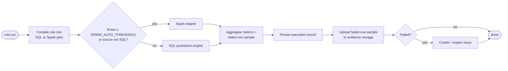

# Rule engine

The rule engine is the core of CogniDQ. This document explains what a
rule is, how rules are evaluated, and how results are scored.

For the catalog of supported rule types and their configuration, see
[rule-types.md](rule-types.md).

---

## What is a rule?

A **rule** is a versioned, schedulable check against a single dataset
that produces a binary pass/fail outcome plus a numeric score.

```jsonc
{
  "id": "rule_01HXYZ...",
  "workspace_id": "ws_demo",
  "dataset_id": "ds_customers",
  "name": "customers.email is not null",
  "type": "completeness",
  "config": {
    "column": "email"
  },
  "threshold": { "operator": "gte", "score": 0.99 },
  "severity": "medium",
  "status": "active",
  "version": 3,
  "schedule": null,
  "owner_user_id": "user_steward"
}
```

Rules are **immutable per version**. Editing a rule creates a new
version; old executions still reference the version they were run
against. This guarantees historical executions remain explainable.

## Anatomy of an execution

When a rule runs, the engine produces an **execution record**:

```jsonc
{
  "id": "exec_01HXYZ...",
  "rule_id": "rule_01HXYZ...",
  "rule_version": 3,
  "started_at": "2026-06-15T10:00:00Z",
  "finished_at": "2026-06-15T10:00:01Z",
  "duration_ms": 920,
  "engine": "sql",                  // "sql" | "spark"
  "rows_total": 5000,
  "rows_failed": 142,
  "score": 0.9716,
  "status": "failed",               // "passed" | "failed" | "errored"
  "evidence_ref": "evidence/ws_demo/exec_01HXYZ.json",
  "error": null
}
```

### Score

For most rule types, the score is a fraction:

```text
score = 1 - (rows_failed / rows_total)
```

A rule **passes** when `score` satisfies the configured threshold:

```text
threshold.operator = "gte" and score >= threshold.score
```

Rule types that are not row-fraction-based (e.g. `freshness`) define
their own scoring; see [rule-types.md](rule-types.md).

### Status

| Status | Meaning |
|---|---|
| `passed` | Rule executed cleanly and the score met the threshold. |
| `failed` | Rule executed cleanly but the score did **not** meet the threshold. |
| `errored` | The execution itself failed (connection error, syntax error, timeout). |
| `pending` | Queued, not yet running. |
| `running` | Currently executing on a worker. |

`errored` is **not** a quality verdict; it is a system error and should
be alerted to operators, not stewards.

---

## Execution path



### SQL pushdown engine

For SQL sources (PostgreSQL today), the engine renders the rule into a
parameterised SQL query that:

1. counts total rows, failed rows, and a sample of failed rows in a
   single round-trip;
2. runs against the source database using the read-only connection
   credentials from the connection record;
3. respects `MAX_EXECUTION_TIME_SECONDS` and `QUERY_TIMEOUT_SECONDS`.

The engine never modifies source data. It also never logs the failed
rows themselves; they go straight to the evidence sample handler.

### Spark engine

For large datasets or non-SQL sources:

1. The worker creates a SparkSession against the configured master
   (`SPARK_MASTER_URL`).
2. The dataset is read using the appropriate Spark reader (JDBC, CSV,
   parquet, etc.).
3. The rule is applied as a DataFrame transformation.
4. Aggregates and a `limit(N)` sample of failing rows are collected back
   to the driver and written to evidence.

Spark integration is configured per `DEPLOYMENT_MODE` —
`docker-compose`, `kubernetes`, `aws-emr`, `azure-databricks`,
`gcp-dataproc`. Today the only path that is exercised in CI is the
`docker-compose` mode against the bundled Spark master.

---

## Failed-row sample (evidence)

For each failing execution, the engine collects a **sample** of the
failing rows (default: first 100, configurable per workspace) and
writes it to MinIO at:

```
evidence/<workspace_id>/<execution_id>.json
```

The execution record stores `evidence_ref` pointing at this object. The
backend reads the evidence on demand for the result UI.

Evidence samples may contain sensitive data. See
[evidence.md](evidence.md) and
[production-hardening.md](production-hardening.md) for masking and
retention.

---

## Issue creation

When `status=failed`, the engine evaluates the rule's
`auto_create_issue` flag (default: true).

If true and there is no open issue for this rule already, it creates
one with:

- title: `<rule.name> — failed`
- severity: from the rule
- assignee: from the rule, falling back to workspace default
- evidence: link to the latest execution

If an open issue exists, it appends a comment with the new execution
reference; it does **not** create a duplicate. This keeps issue noise
bounded.

See [issues.md](issues.md) for the issue lifecycle.

---

## Rule versioning

Editing a rule creates a new version (`rule_versions` table). The
current version is the one with `rule_versions.is_current = true`. Old
executions point at the version they ran against.

Implications:

- Trend dashboards over time may compare across versions; we mark
  version boundaries on the chart.
- Re-running an old execution always uses the **current** version.

---

## Scheduling

Rules can have a schedule expressed as either:

- a fixed interval (`every 5 minutes`, `every 1 hour`), or
- a cron expression (`0 6 * * *`).

The scheduler is Celery Beat. It enqueues `execute_rule` tasks; the
worker pool picks them up. Beat itself runs as a single-instance
container; do not scale it horizontally.

---

## Limitations (v0.1.0-alpha)

- Only PostgreSQL connectors are exercised in tests today; other
  connectors are experimental.
- Cross-dataset rules (rules that join two datasets) are limited to
  `comparison` and `consistency` rule types and only when both datasets
  share a connection.
- The engine does not yet de-duplicate identical concurrent executions
  triggered by both Beat and a manual `Run now` click. The second one
  may queue and run; ignore the duplicate or use the rule lock setting.
- There is no rule import/export UI; you can manage rules via the API
  but a UI flow lands in v0.2.

See [ROADMAP.md](../ROADMAP.md) for the trajectory.
